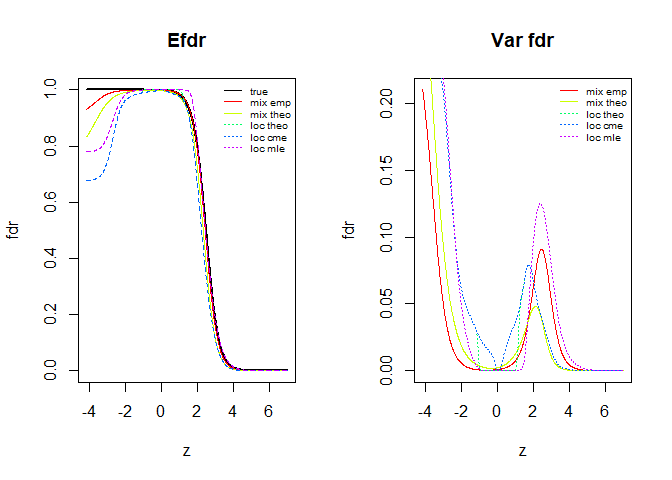
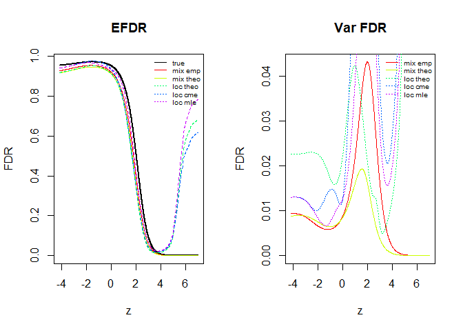

<!-- README.md is generated from README.Rmd. Please edit that file -->

# mix-fdr

<!-- badges: start -->

<!-- badges: end -->

The project `mix-fdr` is the final project of MATH 5472. It aims to
investigate mixfdr, an empirical Bayes method for estimating fdr and
effect size simultaneouly purposed by this paper: Omkar Muralidharan. An
empirical bayes mixture method for effect size and false discovery rate
estimation. Ann. Appl. Stat. 2010.

## Enviromnent

The R code is developed in R version 4.0.2.

``` r
sessionInfo()
#> R version 4.0.2 (2020-06-22)
#> Platform: x86_64-w64-mingw32/x64 (64-bit)
#> Running under: Windows 10 x64 (build 19041)
#> 
#> Matrix products: default
#> 
#> locale:
#> [1] LC_COLLATE=Chinese (Simplified)_China.936  LC_CTYPE=Chinese (Simplified)_China.936    LC_MONETARY=Chinese (Simplified)_China.936
#> [4] LC_NUMERIC=C                               LC_TIME=Chinese (Simplified)_China.936    
#> 
#> attached base packages:
#> [1] stats     graphics  grDevices utils     datasets  methods   base     
#> 
#> other attached packages:
#> [1] locfdr_1.1-8
#> 
#> loaded via a namespace (and not attached):
#>  [1] compiler_4.0.2  magrittr_1.5    htmltools_0.5.0 tools_4.0.2     yaml_2.2.1      splines_4.0.2   stringi_1.5.3   rmarkdown_2.3  
#>  [9] knitr_1.29      stringr_1.4.0   xfun_0.17       digest_0.6.25   rlang_0.4.7     evaluate_0.14
```

To run the simulation code, we first need the following the packages
that provide various empirical Bayes method.

``` r
install.packages("locfdr")
install.packages("EBayesThresh")
```

## Content of codes

  - `mixfdr_fun.R`: containts various functions that implemented the
    mixfdr algorithm
  - `sim_fdr.R`: produce the fdr estimation results in section 2.2 of
    the report
  - `sim_effect_sz.R`: produce the effect sise estimation resluts in
    section 2.1 of the report.

## Running simulation code

### Effect size estimation

To reproduce the Figure 1 in the report, we can source the
`sim_effect_sz.R` directly

``` r
source("sim_effect_sz.R")
```

### Fdr estimation

To reproduce Figure 2, 3, we need to set different values on `N_null` in
the `sim_fdr.R`

  - `N_null = 50` : the original setting in the paper, corresponds to
    figure 2
  - `N_null = 200` : the dense setting on effect size, correspondd to
    figure 3

Then source the script. A small example is that when we set the follwing
parameters in the code

``` r
n_rep = 100
N = 1000
N_null = 200
J = 3
```

The code will output the Figure 3 in the report:

``` r
source("sim_fdr.R")
```

<!-- --><!-- -->
